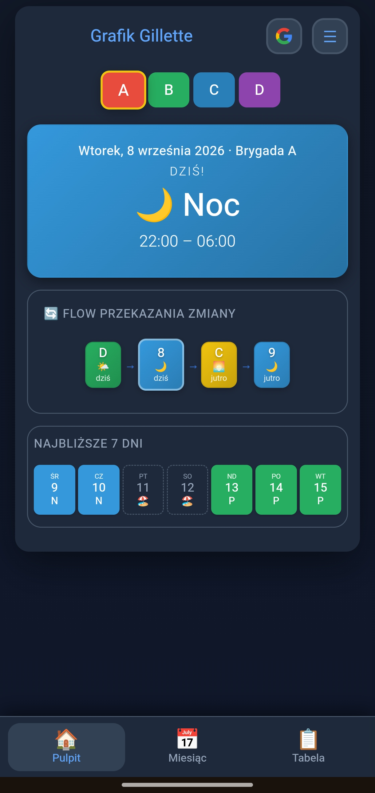
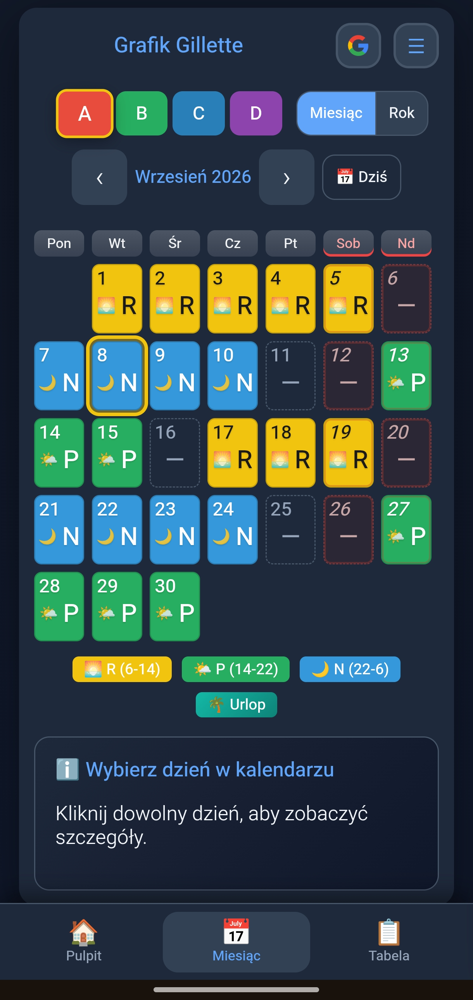
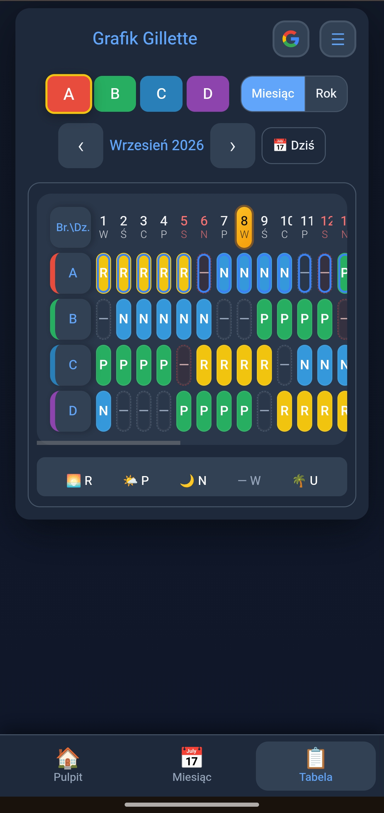
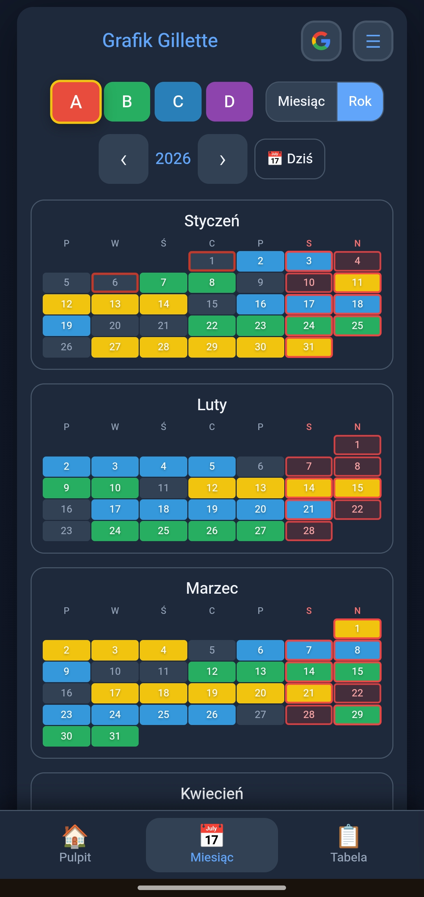
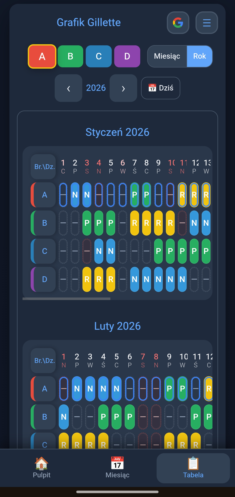
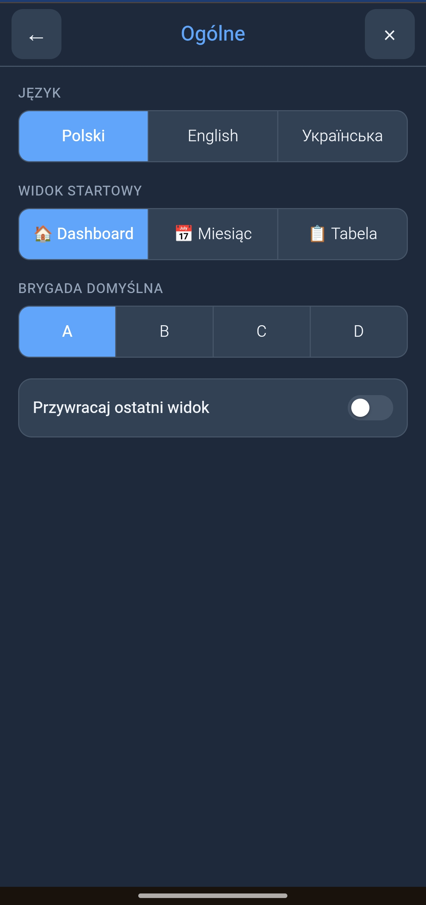
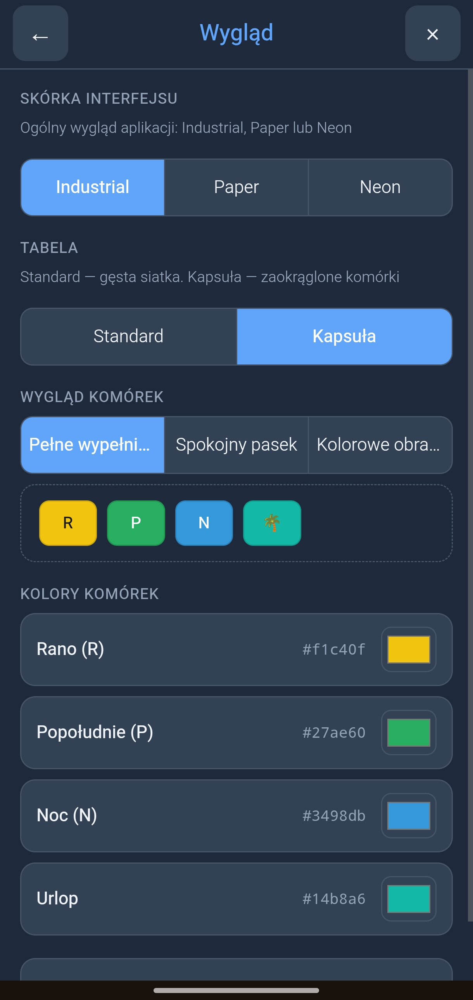
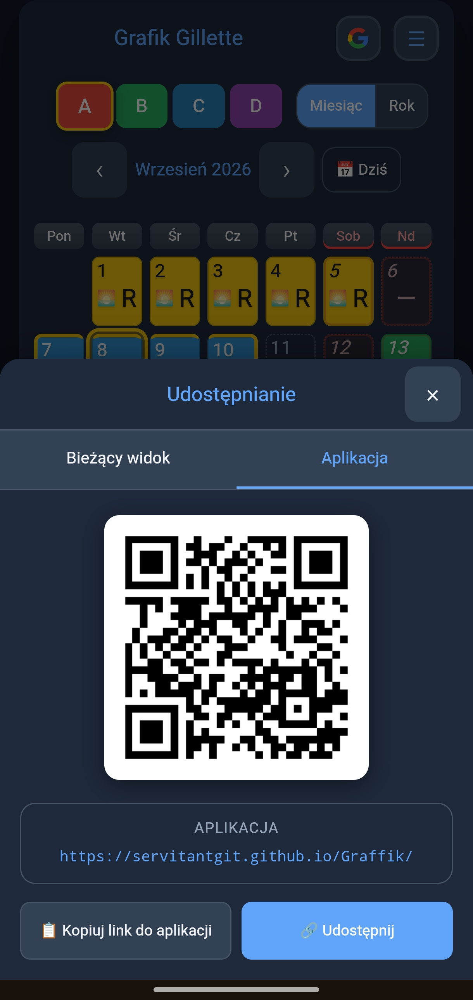

# 📅 Grafik Gillette

**Język / Language / Мова:** [Polski](./README.md) · **English** · [Українська](./README.uk.md)

A PWA for managing shift schedules of 4 brigades working a 3-shift system (Morning/Afternoon/Night). Replaces the paper calendar in the badge holder.

**Demo:** [https://servitantgit.github.io/Graffik/](https://servitantgit.github.io/Graffik/)


## ✨ Key features

- 📊 **4 brigades** (A/B/C/D) with a 3-shift system (M/A/N) + Days off + Vacation
- 🏠 **3 main views**: Dashboard, Month, Table
- 📈 **Year mode** — expands Month/Table to the whole year (12 mini-calendars/tables)
- ✏️ **Schedule editing** (auto-save; vacation limit in edit mode 🌴)
- 🌴 **Vacations** with a per-brigade limit and automatic working-day counting
- ⏱ **Overtime** with auto-categorisation (+50%/+100%/+200%) — for working days AND days off/holidays
- 📝 **Notes** on any day
- 🔍 **Search** across shifts, days off and vacations
- ⚖️ **Brigade comparison** (Ctrl+click)
- 🎨 **2 themes**: light/dark (toggle in the top bar)
- 🌐 **Multilingual**: Polish, English, Ukrainian (🌐 switcher in the top bar)
- 📱 **PWA** — install on your phone, offline mode, notifications
- 📱 **App sharing** — link + QR code + native sharing (SMS, messengers)
- 🔄 **Auto-update** — automatic new-version notice, applied with one click
- ☁️ **Google Drive sync** — data across devices
- 🔗 **Contextual sharing** — a link to exactly the view you are looking at
- 📥 **.ics export** to your calendar, **printing**
- ☁️ **Google Drive** — optional backup and data synchronisation

## 📸 Screenshots

<p align="center">
  <a href="screenshots/1.png"></a>&nbsp;
  <a href="screenshots/2.png"></a>&nbsp;
  <a href="screenshots/3.png"></a>&nbsp;
  <a href="screenshots/4.png"></a>
</p>

<p align="center">
  <a href="screenshots/5.png"></a>&nbsp;
  <a href="screenshots/6.png"></a>&nbsp;
  <a href="screenshots/7.png"></a>&nbsp;
  <a href="screenshots/8.png"></a>
</p>

## 🚀 Quick start

1. Open [https://servitantgit.github.io/Graffik/](https://servitantgit.github.io/Graffik/)
2. Pick a brigade (A/B/C/D) and a year
3. The Dashboard shows today's shift with a timer
4. Switch views from the top menu

**Cell styles:** Personalisation offers three variants: full fill, subtle bar, and coloured border. In the last one, the colour of the cell border and of the ring around the date reflects the shift.

**Feature details:** ☰ Menu → ❓ Help / FAQ · code: [GitHub](https://github.com/servitantgit/Graffik)

## 📱 Installing as a PWA

### Android (Chrome)

- Browser menu (⋮) → "Add to Home screen"
- Or: ☰ Menu → 📲 Install app

### iPhone / iPad (Safari)

1. Open the page in **Safari** (not in another browser!)
2. Tap **Share** ⬆️ at the bottom of the screen
3. Scroll down → **"Add to Home Screen"**
4. Tap **"Add"**

After installation the app runs full-screen, without the address bar, and works offline.

## 🔗 Sharing and URL params

**🔗 Share view** in the side menu creates a link to exactly what you see. The recipient opens the same view.

### URL parameters

| Parameter | Meaning                                  | Example      | Optional |
| --------- | ---------------------------------------- | ------------ | -------- |
| `view`    | View type: `dashboard`, `month`, `table` | `view=month` | No       |
| `y`       | Year                                     | `y=2026`     | No       |
| `m`       | Month (1-12)                             | `m=8`        | Yes\*    |
| `d`       | Day (1-31)                               | `d=10`       | Yes\*    |
| `brig`    | Brigade (A/B/C/D)                        | `brig=C`     | Yes\*    |
| `rok`     | Year mode (1 = on)                       | `rok=1`      | Yes\*    |

\* The parameter is added automatically when it makes sense for the given view.

### URL examples

```
# August 10th, brigade C
?view=month&y=2026&m=8&d=10&brig=C

# All of August, brigade C
?view=month&y=2026&m=8&brig=C

# Year view, brigade C
?view=month&y=2026&brig=C&rok=1

# Table — full year
?view=table&y=2026&rok=1
```

## 📅 Current schedule data

- The repository currently contains the official **Gillette schedule for 2026**.
- Supported brigades: **A, B, C, D**.
- Shifts: **R (morning), P (afternoon), N (night), W (day off)**.
- Further years are added as separate files in `js/schedules/gillette/`.

## 🛠 For developers

### Tech stack

- **Vanilla JavaScript** (ES2020+, no frameworks, no build system)
- **HTML5 + CSS3** (Custom Properties, Flexbox, Grid)
- **i18n**: a small in-house translation system in `js/i18n/` (3 languages, no external dependencies)
- **PWA**: Service Worker + Web App Manifest
- **Google Drive API** (OAuth 2.0)
- **Hosting**: GitHub Pages
- **CI/CD**: GitHub Actions (SW cache auto-versioning on every push)

### Requirements

- A modern browser with ES2020, Service Worker and localStorage support
- **Note**: the PWA and JS modules require HTTP (they do not work from `file://`)

### Running locally

```bash
# Python 3
python -m http.server 8000

# Node.js (if you have http-server)
npx http-server -p 8000
```

Then open: `http://localhost:8000`

### Running tests

```bash
node tests/run.js
```

Works on any Node 18+. The `node --test "tests/*.test.js"` form only works on Node 21+, because Node itself expands globs in `--test` positional arguments only from that version on.

### Project structure

```
Graffik/
├── index.html          # HTML (no inline CSS)
├── manifest.json       # PWA manifest
├── sw.js               # Service Worker (precached ASSETS)
├── css/
│   ├── app-shell.css      # App shell
│   ├── calendar.css       # Month calendar
│   ├── components.css     # Components and Privacy Mode visibility
│   ├── dashboard.css      # Dashboard
│   ├── layout.css         # App layout
│   ├── overtime.css       # Overtime
│   ├── print.css          # Printing
│   ├── responsive.css     # Responsiveness
│   ├── smart-popup.css    # Popups
│   ├── variables.css      # Theme variables
│   └── views.css          # Year and Table views
├── js/
│   ├── schedules/           # Modular data architecture (v3.7+)
│   │   ├── _core.js        # Constants, helpers (monthNames, shiftHours…)
│   │   ├── _registry.js    # Registry + shouldShowPersonalData()
│   │   └── gillette/
│   │       ├── metadata.js # Schedule metadata (brigades, shift types)
│   │       └── 2026.js     # Data for 2026
│   ├── personal/
│   │   ├── sync-tracking.js  # lastModified / lastSync (unsynced state)
│   │   └── notes-tracking.js # Day notes (add/update/delete, counting)
│   ├── overtime-logic.js    # Overtime categorisation +50%/100%/200%
│   ├── core.js              # Storage, getShiftAt, isUrlop, prefs…
│   ├── ui.js                # Toast, Modal, Confirm, theme
│   ├── edit.js              # Immediate shift editing (applyEdit)
│   ├── dashboard.js         # Dashboard (gated by shouldShowPersonalData)
│   ├── calendar.js          # Calendar, popups, overtime
│   ├── views.js             # Year, Table
│   ├── actions.js           # .ics, share, print, admin export
│   ├── pwa.js               # SW registration, notifications
│   ├── sync.js              # Google Drive OAuth + upload/download
│   ├── admin.js             # Admin identification (ADMIN_EMAILS)
│   ├── admin-center.js      # Admin panel
│   ├── app-shell.js         # Shell UI
│   ├── personalization.js   # Cell styles, UI preferences
│   ├── settings.js          # Settings
│   ├── smart-popup.js       # Smart popups
│   ├── i18n/
│   │   ├── pl.js / en.js / uk.js
│   │   └── i18n.js          # t(), setLanguage(), renderFAQ()
│   └── main.js              # State, events, init
├── icons/
│   ├── icon-192.png
│   ├── icon-512.png
│   └── icon-512-maskable.png
├── screenshots/             # Screenshots for the README and the manifest
│   └── 1.png … 8.png
├── docs/                    # Technical documentation
│   ├── AGENT.md             # AI / engineering rules
│   ├── PROJECT_DOCS.md      # Architecture, schema, edge cases
│   └── tests-README.md
├── tools/                   # Dev helpers (check_js, generate_icons, export-code…)
├── tests/                   # Unit tests
├── CHANGELOG.md
└── README.md
```

## ⌨️ Keyboard shortcuts

### Edit mode

| Shortcut                  | Action                                                    |
| ------------------------- | --------------------------------------------------------- |
| `R` / `P` / `N` / `W`     | Pick the shift to paint                                   |
| `C`                       | Cycle mode (shift rotation)                               |
| `O`                       | Overtime mode (before/after a shift AND work on a day off/holiday) |
| `Ctrl+Z`                  | Undo the last change                                      |
| `Ctrl+Y` / `Ctrl+Shift+Z` | Redo the undone change                                    |
| `Ctrl+S`                  | Save all changes                                          |
| `Esc`                     | Leave edit mode                                           |

### Navigation

| Shortcut  | Action                                    |
| --------- | ----------------------------------------- |
| `←` / `→` | Previous/next month                       |
| `E`       | Toggle edit mode                          |
| `Esc`     | Close popup/modal or leave edit mode      |

### Brigade selection

| Action        | Effect                                              |
| ------------- | --------------------------------------------------- |
| `Click`       | Change the active brigade                           |
| `Ctrl + click`| Compare with another brigade (highlights shared shifts) |

## 🌐 Languages

The app supports 3 languages (pick one with the 🌐 button in the top bar):

- 🇵🇱 **Polski** (default)
- 🇺🇸 **English**
- 🇺🇦 **Українська**

The language is detected automatically from browser settings on first launch. The chosen language is stored in localStorage and survives a restart.

**For developers** — adding new translations:

1. Open `js/i18n/pl.js` (or en.js/uk.js) — add a new key with its value
2. **Important**: add the same key in ALL 3 files
3. In HTML use `data-i18n="key"`, in JS: `t('key')` / `t('key', {param: 'value'})`

Key parity, placeholders and dynamic prefixes are checked by `node tools/i18n-audit.js`. The "unused keys" section of that report is informational only: keys reached indirectly (`t(key)` from a variable, lookup maps, dynamically built names) cannot be seen by static analysis, so nothing should be deleted based on that list alone.

## 💾 Data storage

The app stores data in three places:

1. **localStorage** (primary) — vacations, overtime, notes, settings, schedule edits
2. **Google Drive** (optional) — manual synchronisation across devices
3. **JSON backup** — export/import of a file with a full copy of the data

Opening the Drive sync menu shows a **short diff log** (local counts of vacations / overtime / notes / custom shifts vs Drive) and the Cancel / Download / Upload buttons in a single row.

**Note:** data in localStorage can be lost when browser storage is cleared. Make regular backups via 📥 JSON or ☁️ Google Drive.

## 🔒 Privacy

All data is stored locally in the user's browser. Google Drive sync uses the user's own account — no third-party servers. The app sends no data to any other service.

**Visibility of personal data** (vacations, overtime, notes, custom schedule):

- **Signed in** to Google Drive → full personal data is visible
- **Signed out** → the official schedule only (no vacations / OT / notes)

This replaces the old manual "Privacy Mode". Signing in = access to personal data.

## 🐛 Reporting bugs

Found a bug or have a suggestion? Write to: [servitant@gmail.com](mailto:servitant@gmail.com)

Please include:

- Year, date, brigade
- Browser name and device
- A short description of the problem
- A screenshot (if possible)

## 📝 License

MIT License (or an internal factory tool — at the author's discretion)

## 🙏 Author

**Servitant**  
📧 [servitant@gmail.com](mailto:servitant@gmail.com)

---

**Note for developers:** detailed technical documentation (architecture, sync, edge cases) lives in [docs/PROJECT_DOCS.md](./docs/PROJECT_DOCS.md). AI rules — [docs/AGENT.md](./docs/AGENT.md). The in-app FAQ (☰ Menu → ❓) is the user-facing guide.

## Admin: publishing the official schedule

1. Admin Center → editor (local R/P/N/W drafts).
2. **Export** → `YYYY.js` file (this is not publication yet).
3. In the repo: `js/schedules/gillette/YYYY.js` (+ `index.html` / `sw.js` for a **new** year only).
4. `git push` to `main` → GitHub Pages → all users after the SW update.
