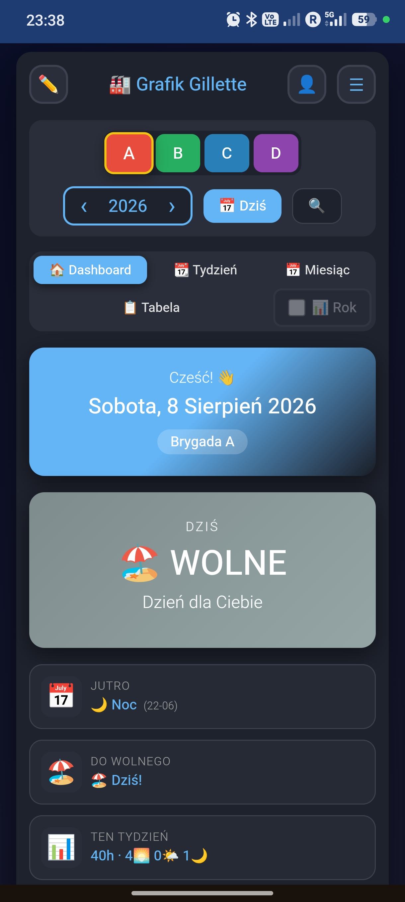
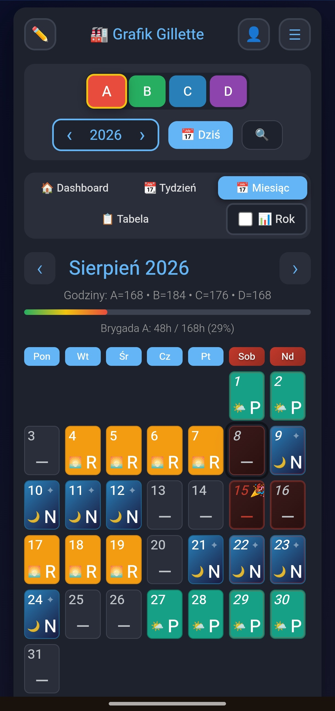
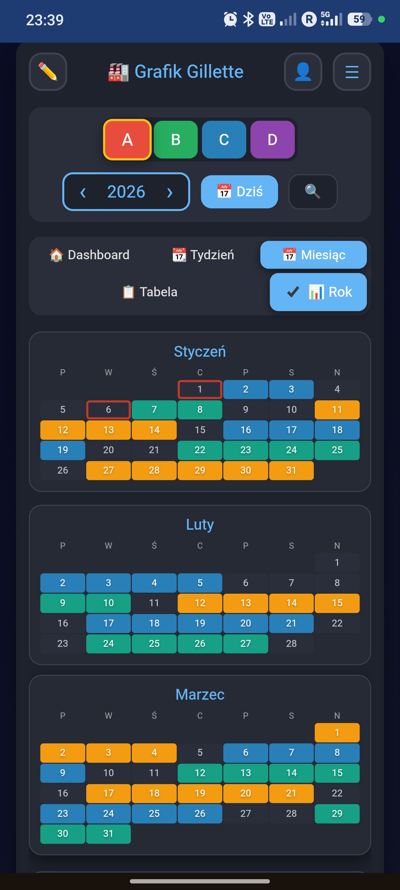

# 📅 Grafik Brygad

Aplikacja PWA do zarządzania grafikami zmian dla 4 brygad pracujących w systemie 3-zmianowym (Rano/Popołudnie/Noc). Zastępuje papierowy kalendarz w plakietce.


## 🚀 Demo / Uruchomienie

- **Wersja online:** [https://servitantgit.github.io/Graffik/](https://servitantgit.github.io/Graffik/)
- Aplikację można zainstalować bezpośrednio na telefonie/komputerze jako **PWA**.
- **Uruchomienie lokalne:**
  ```bash
  python -m http.server 8000
  ```

## ✨ Funkcje

- 📅 Grafik dla 4 brygad (A/B/C/D)
- 🕐 3 zmiany (Rano/Popołudnie/Noc)
- 🌴 Urlopy z automatycznym limitem
- ⏱ Nadgodziny z kategoryzacją (+50%/+100%/+200%)
- ☁️ Synchronizacja Google Drive
- 🔔 Powiadomienia push
- 📱 Instalacja jako PWA
- 🎨 8 motywów kolorystycznych
- 📥 Eksport do Google Calendar / Outlook (.ics)
- 🔒 Prywatność — dane każdego użytkownika w jego własnym Drive
- 💾 Praca offline

## 📱 Zrzuty ekranu

<table>
  <tr>
    <td align="center">
      <a href="./screenshots/dashboard.jpg" target="_blank">
        
      </a>
      <br>
      <sub><b>🏠 Dashboard</b></sub>
    </td>
    <td align="center">
      <a href="./screenshots/miesiac.jpg" target="_blank">
        
      </a>
      <br>
      <sub><b>📅 Widok miesiąca</b></sub>
    </td>
    <td align="center">
      <a href="./screenshots/rok.jpg" target="_blank">
        
      </a>
      <br>
      <sub><b>📆 Widok tygodnia</b></sub>
    </td>
  </tr>
</table>

<sub>💡 Kliknij zdjęcie, aby zobaczyć w pełnym rozmiarze</sub>

## 🛠 Technologie

- HTML5, CSS3 (Custom Properties, Flexbox, Grid)
- Vanilla JavaScript (ES6+, bez frameworków)
- Google Drive API (OAuth 2.0)
- PWA (Service Worker + Web App Manifest)
- GitHub Pages (hosting)

## 📖 Dokumentacja

Szczegółowa dokumentacja techniczna: [PROJECT_DOCS.md](./PROJECT_DOCS.md)

## 🚀 Jak zacząć (dla użytkowników)

1. Otwórz w telefonie: https://servitantgit.github.io/Graffik/
2. Zainstaluj jako aplikację (Chrome/Safari zaproponuje sam)
3. Zaloguj się przez Google Drive (opcjonalne — dla synchronizacji)
4. Wybierz swoją brygadę
5. Gotowe!

## 🤝 Wkład

Sugestie i uwagi mile widziane. Otwórz Issue lub napisz email.

## 📧 Kontakt

Email: tantsiura.s@pg.com

## 📄 Licencja

MIT License
